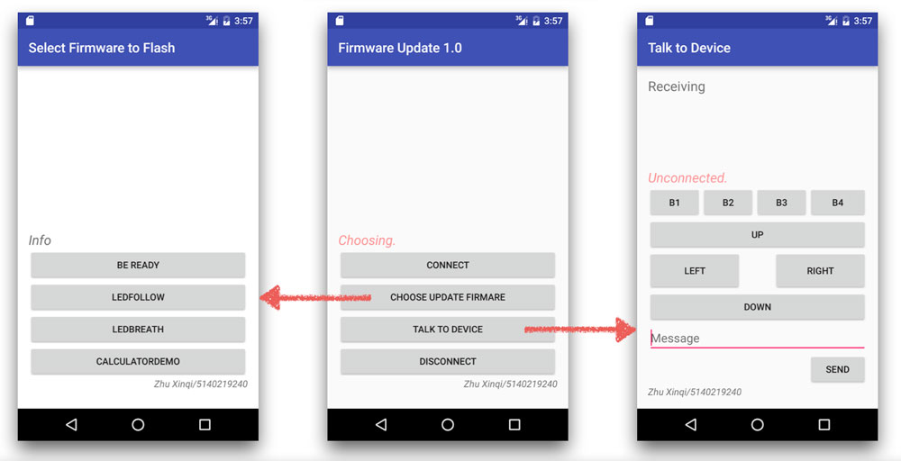

# FirmwareUpdate1.0-Android
This is a simple Android application that can flash firmware into a TI Board(tested on TM4C1294XL) wirelessly through Bluetooth using an Android smart phone (tested with Samsung Galaxy Note3).

If you want to know more about this app, please head to my blog: <a href="http://zhuxinqi.space/project/firmwareupdate.html" class="_blank">http://zhuxinqi.space/project/firmwareupdate.html</a>
